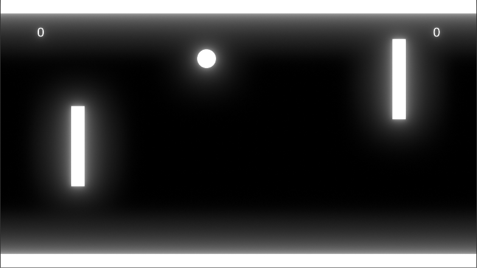
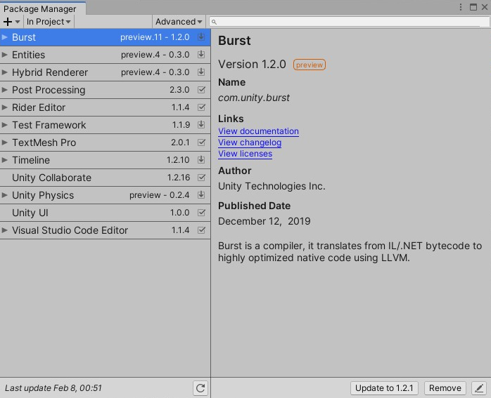

# Unity-PongGame-DOTSStudy

This exemple use the version 2019.3.0f6 of Unity

# Screenshot Exemples

Ingame image

# Project Information

This game is a study about the new Unity Syntax, using DOTS only. The tutorial for this same project, you can find [here](https://www.youtube.com/watch?v=a9AUXNFBWt4&t=2185s)

To play this game, you can move the right paddle with W and S, and the left paddle with Up Arrow and Down Arrow

# Important Information

For this project, was used the folloting assets:

Is extremely important to use the **same version** as shown in the image

# Additional Setting

This game have a responsive screen, so you can play it in every screen with the 16:10 or 16:9 ratio.

You can press ESC to exit.
